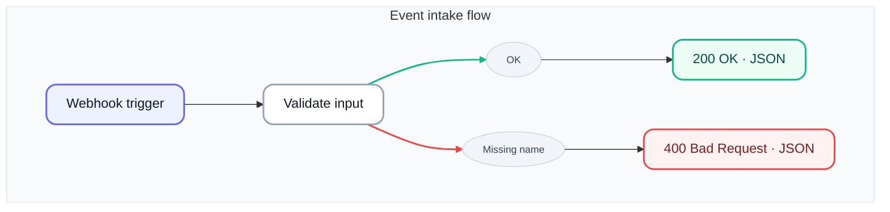

# Workflow diagram

```mermaid
%%{init: {
  "flowchart": { "htmlLabels": false, "curve": "basis", "nodeSpacing": 60, "rankSpacing": 70, "padding": 12 }
}}%%
flowchart LR

  subgraph Intake[Event intake flow]
    direction LR
    A[Webhook trigger]:::trigger --> B[Validate input]:::process

    %% “Badge” nodes instead of arrow labels
    B --> V[OK]:::badge --> C[200 OK · JSON]:::success
    B --> X[Missing name]:::badge --> D[400 Bad Request · JSON]:::error
  end

  %% Container styling
  style Intake fill:#F8FAFC,stroke:#E2E8F0,stroke-width:1px

  %% Node styling
  classDef trigger fill:#EEF2FF,stroke:#6366F1,stroke-width:2px,color:#111827,rx:12,ry:12;
  classDef process fill:#FFFFFF,stroke:#94A3B8,stroke-width:2px,color:#111827,rx:12,ry:12;
  classDef success fill:#ECFDF5,stroke:#10B981,stroke-width:2px,color:#064E3B,rx:12,ry:12;
  classDef error   fill:#FEF2F2,stroke:#EF4444,stroke-width:2px,color:#7F1D1D,rx:12,ry:12;

  %% Badge styling (small pill)
  classDef badge fill:#F1F5F9,stroke:#CBD5E1,stroke-width:1px,color:#334155,rx:999,ry:999,font-size:12px;

  %% Emphasize paths
  linkStyle 1 stroke:#10B981,stroke-width:2px;
  linkStyle 3 stroke:#EF4444,stroke-width:2px;
```
