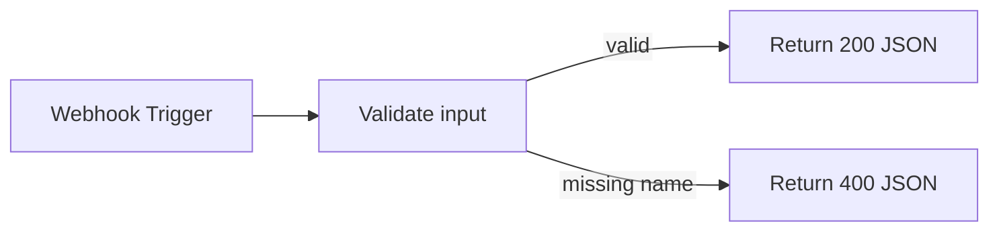

# Workflow diagram

```mermaid
%%{init: {"flowchart": {"htmlLabels": false}} }%%
flowchart LR
  A[Webhook Trigger] --> B[Validate input]
  B -->|valid| C[Return 200 JSON]
  B -->|missing name| D[Return 400 JSON]
```
