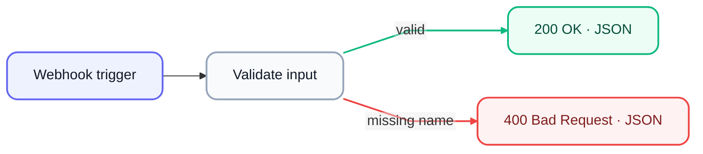

# Workflow diagram

```mermaid
%%{init: {"flowchart": {"htmlLabels": false, "curve": "linear"}} }%%
flowchart LR
  %% Nodes
  A[Webhook trigger]:::trigger --> B[Validate input]:::process
  B -->|valid| C[200 OK · JSON]:::success
  B -->|missing name| D[400 Bad Request · JSON]:::error

  %% Styling
  classDef trigger fill:#EEF2FF,stroke:#6366F1,stroke-width:2px,color:#111827,rx:12,ry:12;
  classDef process fill:#F8FAFC,stroke:#94A3B8,stroke-width:2px,color:#111827,rx:12,ry:12;
  classDef success fill:#ECFDF5,stroke:#10B981,stroke-width:2px,color:#064E3B,rx:12,ry:12;
  classDef error   fill:#FEF2F2,stroke:#EF4444,stroke-width:2px,color:#7F1D1D,rx:12,ry:12;

  %% Optional: emphasize paths (0-based link indices)
  linkStyle 1 stroke:#10B981,stroke-width:2px;
  linkStyle 2 stroke:#EF4444,stroke-width:2px;
```
